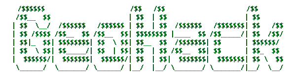

# GeoHack

# 
- Download Node.js
- Obtain a API key from [MapBox](https://www.mapbox.com/)
- Clone the repo
 ```
 git clone git@github.com:njhama/GeoHack.git
 ```
- Enter API Key into code
  - Navigate into client > main.js
  - Replace ENTER_API_KEY with your MapBox API key
   ```
   const API_KEY = "ENTER_API_KEY";
   ```

# Running the Program
- Open client/index.html in a web browser, enter a port
- CD into the server and run the server using node, enter the port as an argument
 ```
node server.js 9000
 ```

# Notes
- Browser size may be changed in server/server.js on line 8 -9
```
let heightInpt = 1200;
let widthInpt = 1200;
```

# Disclaimer
This tool is intended for educational purposes only and is only a proof of concept. 

# Links
- [Node.js](https://nodejs.org/en/download/)
- [MapBox](https://www.mapbox.com/)
