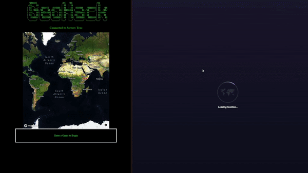

# 

# Getting Started
- Download Node.js from [Node](https://nodejs.org/en/)
- Obtain a API key from [MapBox](https://www.mapbox.com/)
- Clone the repo
 ```
 git clone git@github.com:njhama/GeoHack.git
 ```
- Create config.js and declare API_KEY var with your MapBox API Key
   ```
   const API_KEY = "ENTER_API_KEY";
   ```

# Running the Program
- Open client/index.html in a web browser, enter a port
- CD into the server and run the server using node, enter the port as an argument
 ```
cd server
node server.js 9000
 ```


# Notes
- Settings may be changed in settings.js

# Disclaimer
For educational purposes.

# Download Links
- [Node.js](https://nodejs.org/en/download/)
- [MapBox](https://www.mapbox.com/)
